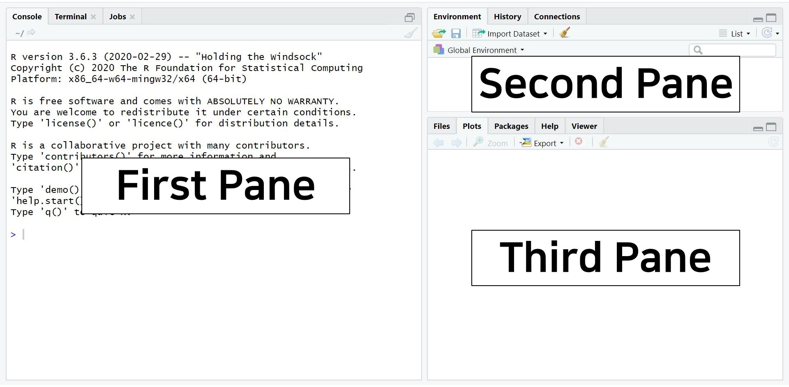
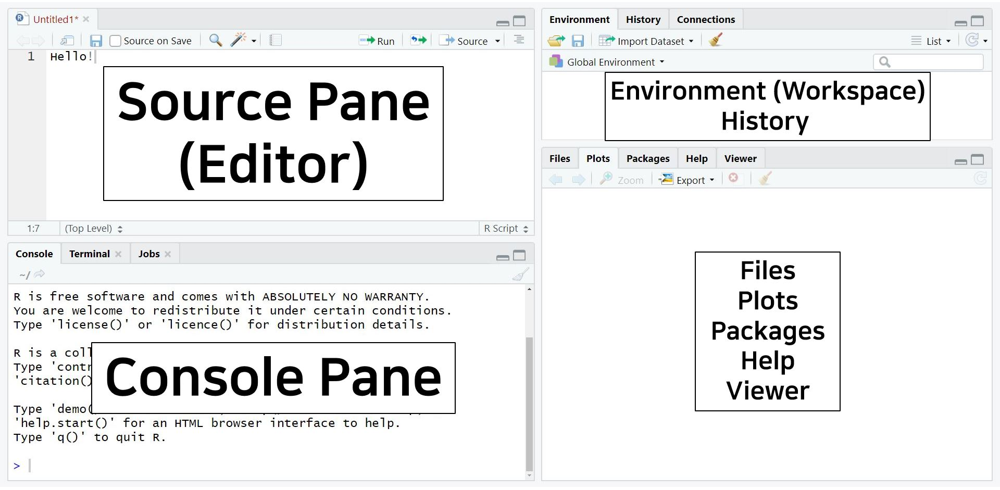

# Introduction to R: Part 1

## Word of wisdom


- Don't worry about making mistakes; it's part of the process.

- Feel free to ask questions to me or your peers.

- Remember, there isn’t just one way to solve a problem.

- Be a wise user of resources like Google, YouTube, or AI.

- Keep in mind that you’re not the only one struggling.

## How R you?

### Open RStudio

- Can you find three panes?



### Open a new R script

- Can you find four panes?



### Individualize R

- Can you find your own R style?


### Some useful settings


- Under "Workspace":
  - Uncheck restore .RData into workspace at startup.
  - Save workshop to .Rdata on exit: "Never".
- Under "History":
  - Uncheck "Always save history (even when not saving .RData).
  - Uncheck "Remove duplicate entries in history".

## Interacting with R

- How to run R commands?
  - Put your cursor on a line, or select the line(s), hit the Run button.
  - The hot key for Run the current line'selection is Ctrl + Enter (Windoes) or Command + Return (Mac).

- Can you run the below code?

```{r, eval=FALSE}
greetings <- "Hello PSY202A"
print(greetings)
```

- Everything starting with a pound sign (#) is considered as a comment. R will skep all the characters after # until it finds a new line of command.

- Can you run the below code?

```{r, eval=FALSE}
Comment

# Comment
```

## Numerical computation

### Using R as a numerical calculator

- Can you run the code below?

```{r, eval=FALSE}
2 + 4 # Addition
2 - 4 # Subtraction
2 * 4 # Multiplication
2 / 4 # Division
2 ** 4 # Power
sqrt(144) # Square root
log(144) # Natural logarithm
exp(5) # Exponential, i.e., power of e
(10 + 2*log(8) - (exp(8) - 4)/3) * 7
```

- Here, ``sqrt()``, ``log()``, and ``exp()`` are numerical functions.

#### Exercise: Numerical calculator

- Can you give me the answer to the mathematical formula below?

$$
\frac{26}{\text{log}(5)}\times e^{3} + (-0.2)
$$

- How about this?

$$
-\sqrt( \text{ln}7 )
$$

### Using R as a logical calculator

- You can also use R for logical statements.

```{r, eval=FALSE}
1 == 1 # equal
1 != 2 # unequal
10 > 1 # greater than
10 >= 1 # greater than or equal to
```

#### Exercise: Logical calculator

- Then... can you program your code to evaluate the below statements?
  - Try this first: 5 is lower than or equal to 10. What is the result? Does this make sense?
  - Then, try this second: 10 is not equal to 10. What is the result? Does this make sense?

## Types of objects

- In R, anything with a name is an object.
  - You can give an object with any name you want insofar as that name is taken in R already.

- An object can contain more than one value and have more complex data strutures, such as:
  - vector: a series of values of the same data type
  - matrix: a two-dimensional table of values with the same data type
  - data frame: a two-dimensional table of values, may not be the same data type
  - list: an object made of objects

### Vector: Intro

- The concatenate function ``c()`` is usually used to put a set of values together.
  - An object ``iq`` is a vector of 5 IQ scores.

```{r, eval=FALSE}
# A vector of IQ scores
iq <- c(90, 100, 105, 110, 95)

# Here, 'iq' is an object

# Print the IQ object
print(iq)
iq
```

- Out of curiosity, what should we do if we want to know the sum of all the five iq scores? You can use the ``sum()`` function. Can you try?

```{r, eval=FALSE}
# Hint: put an object name within the sum()
```


- Many other functions also return vectors as results.
  - For instance, the sequence operator (:) generates consecutive numbers.

```{r, eval=FALSE}
numbers <- 1:100
numbers
```

#### Exercise: Vector intro

- There are other specific functions. Can you guess what each of the functions does?

```{r, eval=FALSE}
# Describe what the below function does: 
values_1 <- seq(1, 5, by = 1)

# Describe what the below function does: 
values_2 <- seq(1, 5, by = 0.5)

# Describe what the below function does: 
values_3 <- rep(1, 5)

# Describe what the below function does: 
values_4 <- rep(1:5, 3)
```

### Vector: Advanced

- There are a couple of distribution functions that can be used to generate a vector of random numbers from a specific distribution.

- For example, you can generate 5 random numbers from a normal distribution with a mean of 0 and a standard deviation of 1:
```{r, eval=FALSE}
random_normal <- rnorm(5, 0, 1)
random_normal
```

- As another example, you can generate 5 random numbers from a uniform distribution between 0 and 1:
```{r, eval=FALSE}
random_uniform <- runif(5, 0, 1)
random_uniform
```

- The standard arithmetic operators and functions apply to vectors on a element-wise basis.

```{r, eval=FALSE}
A <- c(1, 2, 3, 4) - 4
A

B <- c(1, 2, 3, 4)/4
B

C <- c(1, 2, 3, 4)/c(4, 3, 2, 1)
C

D <- log(c(1, 2, 3, 4))
D
```

- All elements in a vector must be the same type
  - Numeric, character (aka. string), logic

```{r, eval=FALSE}
numeric_vector <- c(1, 2, 3, 4)

character_vector <- c("developmental", "health", "quantitative")

logical_vector <- c(FALSE, TRUE, FALSE, FALSE)
```

#### Exercise: Vector advanced

Can you run the code below? What do you see?

```{r, eval=FALSE}
numeric_vector^2

1/numeric_vector

numeric_vector + character_vector

character_vector + logical_vector

numeric_vector + logical_vector

logical_vector + logical_vector

logical_vector+5
```

### Matrix: intro

- We can create a matrix by combining multiple vectors (e.g., perhaps associated with multiple scales)

```{r, eval=FALSE}
scale1 <- c(1, 4, 7, 4, 5)
scale2 <- c(5, 6, 8, 3, 2)
scale3 <- c(0, 9, 8, 9, 3)
```

- We could arrange these into a table, using ``cbind()`` function (bind by column).

```{r, eval=FALSE}
my_data <- cbind(scale1, scale2, scale3)
my_data
```

- Or, if our data were in one long vector:

```{r, eval=FALSE}
long_vec <- c(scale1, scale2, scale3)
my_matrix <- matrix(long_vec, ncol = 3, byrow = FALSE)
my_matrix
```

### Matrix: advanced

- Find the size of the matrix (i.e., the number of rows and the number of columns) using ``dim()``:

```{r, eval=FALSE}
dim(my_matrix)
```

- ,where this parallels ``length()`` for vectors:

```{r, eval=FALSE}
length(scale1)
```

#### Exercise: matrix advanced

- Can you create an arbitrary matrix with 5 rows and 3 columns? You can do anything to achieve this goal.

- If you are successful, can you transpose the matrix using the ``t()`` function?

- What is the size of the transposed matrix?

### Data frame

- Similar to matrices, data frames can be created by combining multiple vectors, but data frames allow for different vector types (e.g., number, character, logical), but preserves the characteristics of each type.

```{r, eval=FALSE}
v1 <- 1001:1006
v2 <- c(407.56, 442.20, 385.85, 295.31, 408.10, 280.52)
v3 <- c("A", "A", "A", "B", "B", "B")

my_dataframe <- data.frame(id = v1, reactiontime= v2, condition = v3)
my_dataframe
```

#### Exercise: data frame

- Can you describe the differences between a matrix and a data frame in R?

### List

- Data frames must be rectangular, what if our data are non-rectangular?

```{r, eval=FALSE}
mod_A <- c(4.25, 2.36, 2.37)
mod_B <- c(4.26, 2.45, 2.31, 7.5)
mod_C <- c(4.21, 2.44, 2.29, 7.7, 4.1)
flag <- c(FALSE, FALSE, TRUE)
```

- A list will allow any set of R objects to be combined into a single object

```{r, eval=FALSE}
my_list <- list(parA = mod_A, parB = mod_C, parC = mod_C, flag = flag)
my_list
```

### Exercise: Selecting elements in objects

- We can select elements of vectors, matrices, data frames, and lists using brackets (i.e., []).

- For each chunk of the code below, think of the expected output before running the code, and see if your guess was correct after running the code:

#### For vectors

- Given the vector below:

```{r, eval=FALSE}
scale1 <- c(1, 4, 7, 4, 5)
```

- Can you expect the outcome?

```{r, eval=FALSE}
scale1[3]
```

#### For matrices

- Recall that this is our predefined matrix object:

```{r, eval=FALSE}
my_matrix
```

- Can you expect the outcome?

```{r, eval=FALSE}
my_matrix[ , 2]
my_matrix[1,  ]
my_matrix[1, 2]
my_matrix[1:2,  ]
my_matrix[ , 1:2]
```

#### For data frames

- Recall that this is our predefined data frame object:
```{r, eval=FALSE}
my_dataframe
```

- Can you expect the outcome?

```{r, eval=FALSE}
my_dataframe[1, 1]
my_dataframe[1:2,  ]
my_dataframe[ , 1:2]
my_dataframe$id
```

#### For lists

- Recall that this is our predefined list object:

```{r, eval=FALSE}
my_list
```

- Can you expect the outcome?
  - Note that, for list objects, we sometimes need to use the double brackets to extract an element of a part of a list

```{r, eval=FALSE}
my_list[1]
my_list[[1]]
my_list[2]
my_list[[2]]
my_list$parB
```

#### Another bonus exercise for you

- Create a new data frame using the following vectors:

```{r, eval=FALSE}
id <- c(1001:1040)
x <- runif(40, 250, 500)
y <- x * 0.2 + runif(40, 200, 450)
gender <- sample(c("M", "F"), 40, replace = TRUE)
```

- Get the mean of y in the data frame you just created. (Hint: use $ to extract the variable; use function
mean() to compute the mean.)

## Workspace

- Recall that everything that has a name in R is called an object.
- The workspace is your current R working environment and includes every user-defined objects, such as vectors, matrices, data frames, lists, etc.
- The ls() function will list all the objects in a workspace.
- The object(s) can be removed from the workspace by the ``rm()`` function.

### Functions to manage workspace

- Can you run the code below and see what happens? Can you understand what is happening?

```{r, eval=FALSE}
ls()
```

- What about this? What happened?

```{r, eval=FALSE}
rm(v1)
ls()
```

- Shall we remove all the objects?

```{r, eval=FALSE}
# Remove all the objects in the workspace
rm(list=ls(all = TRUE))
```

- If you haven't unchecked the box about Workspace in the Global Options, at the end of an R session, you will be asked whether you want to save an image of the current workspace that is automatically reloaded the next time R is started. Choose NO.
- Note that the workspace consists only of R objects, not of any of the output that you have generated during a session (e.g., images). If you want to save your output, just copy it from the console.
- Also, there are ways to export your data and save them in some specific formats for further uses.


## Working directory

- The working directory is the location (file path) on your computer where R will look for files and where it will save any files.
  - For more details, see https://www.rensvandeschoot.com/tutorials/r-for-beginners/

- To see your current working directory, use ``getwd``:

```{r, eval=FALSE}
getwd()
```

- You can also check the current working directory by looking at bar at the top of the Console pane.

- To change your working directory, use ``setwd()``:
  - For Windows users, ## use / instead of \

- You can also manually set the working directory in the Files tab.

- If you start an R session from a .R file, the default working directory will be set to where the .R file is located on your computer.

## Importing external data

- The most common way is to use the function ``read.table()`` to read in .txt files or .dat files; or ``read.csv()`` for .csv files.

```{r, eval=FALSE}
mydata1 <- read.table(file = "Lab 1/SAT.dat", header = TRUE)
class(mydata1)
write.csv(mydata1, file = "Lab 1/newSAT.csv", row.names = FALSE)
```

- You can try this as well:

```{r, eval=FALSE}
mydata2 <- read.csv(file = "Lab 1/SAT.csv", header = TRUE, sep = ",")
class(mydata2)
```

- You can also manually choose a file to import
  - But this will not work for all data formats, so be careful

```{r, eval=FALSE}
mydata3 <- read.table(file.choose(), header = TRUE)
class(mydata3)
```

- To look at the whole dataset, directly type the name of it.

```{r, eval=FALSE}
mydata1

mydata2

mydata3
```

- To obtain a single variable from the dataset, use a dollar sign ($)

```{r, eval=FALSE}
mydata1$Math
```

- Can you get the sum and the mean of the math scores using the ``sum()`` and ``mean()`` functions?

## Exporting

- Similar to ``read.table()``, the most-used expoert function is ``write.table()``.
- You can export your data into some different formats than it was originally imported.
- To export the mydata1 into a tab-delimited file without row nmaes:

```{r, eval=FALSE}
write.table(mydata1, file = "SAT.txt", sep = "\t", row.names = FALSE, col.names = TRUE)
## sep="\t" tells R to use tab as separator in the text file. You can also try sep=" ", or sep=",".
```

- Similar to ``read.csv()``, there is a function ``write.csv()``.

## Final exercise

1. Create a folder named ``PSY202A_Lab 1``, move the data file ``SAT.csv`` in it. Then create a new R script file using the File menu -> New File -> R Script.
2. Change the working directory to ``PSY202A_Lab 1``.
3. In the new R script, write R code to examine the data:
- Read in ``SAT.csv`` file, name it as datSAT;
- Check the first 6 rows of the data set;
- Find the total number of observations in the data set using the ``nrow()`` function;
- List all the values in the State variable;
- Compute the mean of Verbal scores;
- Create a new variable ``Combined``, which equals the sum of Verbal and Math.
  - Hint: assign the sum of two variables to ``datSAT$Combined``.
4. Save the data set datSAT (now with a new variable Combined) to your working directory ``PSY202A_Lab 1``, and name it as ``SATCombined.csv``.
5. Save your R script as ``Exercise 1.R`` in your working directory ``PSY202A_Lab 1`` (File menu -> Save).

## R Markdown

- Reproducibility is a key philosophical principle in the psychological sciences.

- An easy yet elegant way to ensure reproducibility in R programming is by using R Markdown for documentation.

- I strongly recommend downloading R Markdown before our next meeting. You can find resources at:
  - https://rmarkdown.rstudio.com/lesson-1.html
  - https://vimeo.com/178485416
  - https://yihui.org/tinytex/

- This is a great opportunity to learn how to use R Markdown, which you can then apply when submitting your upcoming homework assignments.
