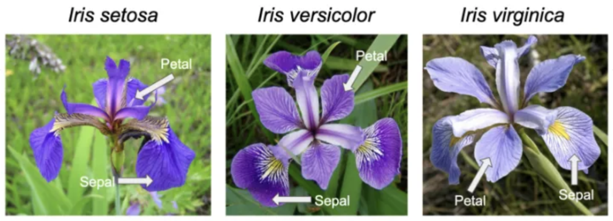

# Introduction to R: Part 2

## What will we do?


## Packages

- A package is a collection of previously programmed functions and data sets, often including functions for specific tasks.
- Some packages come with the base installation of R.
- There are thousands of user-contributed packages that you must manually download and install.
- To see which packages you have, click View -> Show Package.
- To see all available packages: https://cran.r-project.org/web/packages/
- Some packages can be very handy when working with psychological data.
  - The ``psych`` package is a general-purpose toolbox for analyzing psychological data.
  - The ``haven`` package can be used to import and export SPSS, Stata, and SAS files.

### Installing packages

- The easiest way to install packages and add packages to the base version of R is to use the Tools -> Install Packages...
- Or use ``insstall.packages()`` function as follows:

```{r, eval=FALSE}
install.packages("psych")
install.packages("haven")
```

### Loading packages

- To access the package you have already installed, load it to the current R session using the function ``library()``.

```{r, eval=FALSE}
library(psych)
library(haven)
```

## Getting help

- There are many ways to getting help for R programming.

### Modern way of getting help

- Google is your friend.
- Stack Overflow is your cool friend.
- YouTube is your another wonderful friend.
- AI is your badass friend.

### Traditional way of getting help

- When R was installed, HTML format help files were copied on your hard drive.
- To access these files, you can click Help -> R Help.
- Or just type:

```{r, eval=FALSE}
help.start()
```

- To request an R document for a special function, use "?". To illustrate:

```{r, eval=FALSE}
?log
# This will pull up an Internet window with everything about the function log()
```

- To request help by keywords, use "??". To demonstrate:

```{r, eval=FALSE}
??logarithm
# This will give you an information window 
# listing all the functions that contain the term "logarithm".
```

- To request help for a specific package, use ``help(package = " ")``. That said:

```{r, eval=FALSE}
help(package = "psych")
```

## Tidyverse

- The tidyverse is a collection of R packages for data analysis that are developed with common ideas and norms - the tidyverse style.
- More and more popular in recent years.
- Website: https://www.tidyverse.org/packages
- To install and load the tidyverse packages:

```{r, eval=FALSE}
install.packages("tidyverse")
library(tidyverse)
```

- Purpose is to make R code easier to work with:
  - Data manipulation
  - Data visualization
  - Programming
  - Integration with other packages
  - ...and more

- Book recommended: R for Data Science
  - Freely available at https://r4ds.had.co.nz/


### Tidyverse basics

- As it is difficult to change how fundamental base R structures/functions work, the tidyverse suite of packages creates and uses data structures, functions, and operators to make working with data more intuitive.
- The two most basic changes are in the use of pipes and tibbles.

```{r, eval=FALSE}
# Packages for tidyverse demo
library(datasets)
library(tidyverse)
```

### Pipes

- Stringing together commands in R can be quite daunting. Also, trying to understand code that has many nested functions can be confusing.
- To make R code more human readable, the Tidyverse tools use the pipe, ``%>%``, which was acquired from the magrittr package and comes installed automatically with Tidyverse.
- The pipe allows the output of a previous command to be used as input to another command instead
of using nested functions.
- Hint: The shortcut to write pipe is ``shift + command + M``.

#### Exercise: pipes

- Base R method of running more than one command

```{r, eval=FALSE}
sqrt(83)
round(sqrt(83), digit = 2)
```

- Running more than one command with piping

```{r, eval=FALSE}
sqrt(83) %>% round(digit = 2)
```

### Tibbles

- A core component of the tidyverse is the tibble.
- Tibbles are a modern rework of the standard ``data.frame``, with some internal improvements to make code more reliable.
- They are data frames but do not follow all of the same rules. For example, tibbles can have column names that are not normally allowed, such as numbers/symbols.
- Tibbles can be created directly using the ``tibble()`` function or data frames can be converted into tibbles using ``as_tibble(name_of_df)``.
- In this section of code, the iris data frame is converted into a tibble. The iris dataset consists of five variables: ``Sepal.Length``, ``Sepal.Width``, ``Petal.Length``, ``Petal.Width``, and ``Species``.



```{r, eval=FALSE}
# Loading the iris dataset from the datasets package
data("iris")

# Converting the iris data.frame into a tibble object
tibble_iris <- as_tibble(iris)

# Using a data.frame as a tibble with a pipe operator
iris %>% as_tibble()
```

### Differences between tibbles and data.frames

- The main differences between ``tibbles`` and ``data.frames`` relate to printing and subsetting.

#### Printing

- A nice feature of a tibble is that when printing a variable to screen, it will show only the first 10 rows and the columns that fit to the screen by default.

```{r, eval=FALSE}
# Default printing of data.frame
iris # Prints 150 rows

# Default printing of tibble
iris %>%
  as_tibble() # Prints 10 row
```

- This is nice since you don't have to specify head() to take a quick look at your dataset.
- If it is desirable to view more of the dataset, the print() function can change the number of rows or columns displayed.

```{r, eval=FALSE}
# Printing of tibble with print() - change defaults
iris %>%
  as_tibble() %>%
  print(n = 20, width = Inf)
```

#### Subsetting

- When subsetting base R data.frames the default behavior is to simplify the output to the simplest data structure (i.e., a vector).
- If you use piping to subset a data frame, then the notation is slightly different from base R, requiring a placeholder ``.`` prior to the ``[ ]`` or ``$``.

```{r, eval=FALSE}
# Subsetting the Species variable in base R
iris$Species
iris[ ,"Species"]

# Subsetting the Species variable in output using a pipe
iris %>% .$Species
iris %>% .[ ,"Species"]
```

- Note that some older functions do not work with tibbles, so if you need to convert a tibble to a data.frame, the function as.data.frame(name_of_tibble) will easily convert it.

### Tidyverse tools

- Tidyverse has many tools for data wrangling, cleaning, and visualization.

#### dplyr

- Perhaps the most useful tool in the tidyverse is dplyr. It’s a Swiss-army knife for data wrangling.
- dplyr has many handy functions:

  - ``select()`` extracts columns and returns a tibble.
  - ``arrange()`` changes the ordering of the rows.
  - ``filter()`` picks cases based on their values.
  - ``mutate()`` adds new variables that are functions of existing variables.
  - ``rename()`` easily changes the name of a column(s).
  - ``summarise()`` reduces multiple values down to a single summary.
  - ``pull()`` extracts a single column as a vector.
  - ``_join()`` group of functions that merge two data frames together (e.g., ``inner_join()``, ``left_join()``, ``right_join()``, and ``full_join()``).

- Here is an example of the ``select()``, ``filter()``, and ``summarise()`` functions using the iris dataset.

```{r, eval=FALSE}
# Only select the columns related to the Sepal of the iris
iris %>%
  select(Sepal.Length,Sepal.Width) %>%
  head()
```

```{r, eval=FALSE}
#F ilter for irises with a Sepal.Length greater than 5 and Sepal.Width greater than 4
iris %>%
  filter(Sepal.Length > 5, Sepal.Width > 4)
```

```{r, eval=FALSE}
# Calculate the average Sepal.Length and Sepal.Width for each iris Species
iris %>%
  group_by(Species) %>%
  summarise(mean.Sepal.Length = mean(Sepal.Length), mean.Sepal.width = mean(Sepal.Width))
```

## Final exercise

1. Subset the ``Species`` column from the iris dataset using a pipe.
- Hint: Use a ``.`` before the ``[ ]`` or ``$``.
2. Select the ``Petal.Length`` and ``Petal.Width`` columns from the iris dataset.
3. Find the average ``Petal.Length`` and ``Petal.Width`` for each iris Species.

## Bonus: R Markdown

- If you have not downloaded the R Markdown yet, please go to https://rmarkdown.rstudio.com/lesson-1.html and download the ``rmarkdown`` package.
- R Markdown is a tool for reproducible documentation in statistics. R markdown generates a new file that contains selected text, code, and results from the ``.Rmd`` file.
- The newly created file can be a finished website, PDF document, Word document, slide (beamer, powerpoint, xaringan) show, notebook, handout, book, dashboard, Shiny Apps, package vignette, or more.

### How does the R Markdown work?


- According to https://rmarkdown.rstudio.com/lesson-2.html,
  - When you run render, R Markdown feeds the ``.Rmd`` file to ``knitr``, which executes all of the code chunks and creates a new markdown (.md) document which includes the code and its output.
  - The markdown file generated by ``knitr`` is then processed by ``pandoc`` which is responsible for creating the finished format.
  - This may sound complicated, but R Markdown makes it extremely simple by encapsulating all of the above processing into a single render function.

#### Practice

- Generate any PDF document from R Markdown by knitting your markdown file.
- You may need to visit:
  - https://yihui.org/tinytex/
  - https://yihui.org/tinytex/r/#debugging


