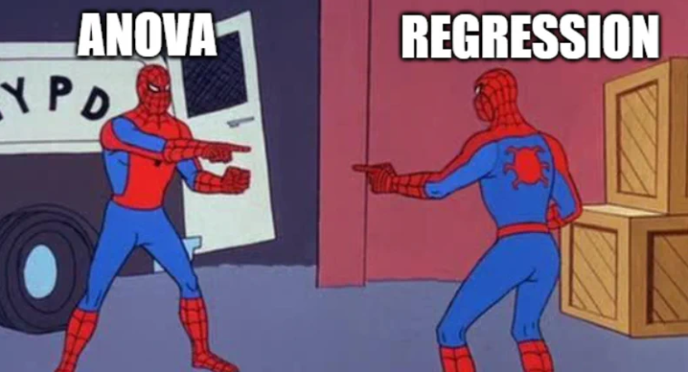
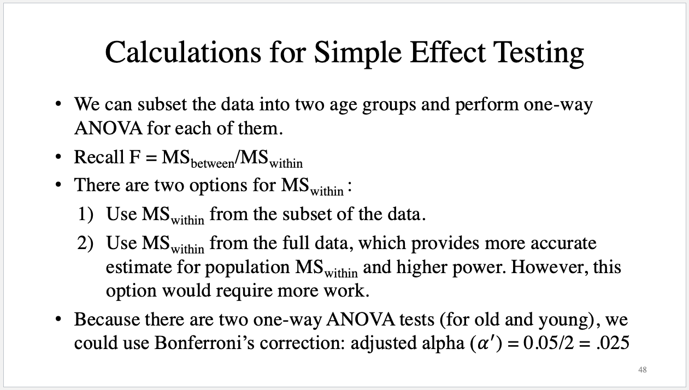

# Regression and ANOVA

## Your first Ph.D. statistics course is almost done

- Keep up the excellent work! You're nearly there!


### Regression vs. ANOVA



- In general, remember that both regression and ANOVA are part of the broader class of general linear models.

- The term 'general linear model' refers to conventional linear regression models for a continuous response variable given continuous and/or categorical predictors.

  - For your information, the term 'generalized linear model' refers to a larger class of models that is assumed to follow an exponential family distribution. See https://online.stat.psu.edu/stat504/lesson/6/6.1.
  
  - For your additional information, the term 'generalized linear mixed model' refers to an even further extension of general linear models that permis random effects as well as fixed effects in the linear predictor. See https://online.stat.psu.edu/stat504/lesson/generalized-linear-mixed-models.

- Out of curiosity... are you familiar with ANCOVA...?

## What Do We Do Today?

### Goals

- HW7 (one-way ANOVA) and HW8 (factorial ANOVA) are upcoming. Therefore, we will first discuss ANOVA, focusing on helping you succeed with these assignments.

- We will also discuss regression analysis. Let's approach it with a relaxed and review-oriented mindset.

### Packages

- Initial setting

```{r}
# Clean the workspace
rm(list=ls());gc()

# Set the working directory
setwd("/Users/ihnwhiheo/Github/PSY202A_Modeling")
getwd()
```

- Let's load R packages that will be used throughout.

```{r, message=FALSE}
# List of packages
packages <- c("psych", "QuantPsyc", "car", "apaTables", "report", "multcomp",
              "palmerpenguins", "tidyverse", "ggformula", "emmeans") # Add the package names you need

# Check, install, and load each package
for (package_name in packages) {
  if (!requireNamespace(package_name, quietly = TRUE)) {
    install.packages(package_name, dependencies = TRUE)
  }
  library(package_name, character.only = TRUE)
}
```

- We will be using with the `sat.act` dataset in the R `psych` package.
  - The dataset consists of self-reported scores of 700 subjects on the SAT Verbal, SAT Quantitative and ACT. Additional variables include age, gender (0=female, 1=male), and education ().

```{r}
# Load data
data(sat.act)
dat <- sat.act
```

- In the original dataset, gender is coded as 1 for males and 2 for females.

- The education variable is categorical, ranging from 1 (high school) to 5 (graduate work). For the variables coded as 0, I could not find the exact coding scheme, so we assume that 0 refers to no education.

- While the other variables are continuous and require no data preprocessing, we will perform some quick data engineering for gender and education.

- Specifically, we will recode gender so that females (originally coded as 2) become the reference category by assigning them a value of 0. Additionally, we will treat the education variable as categorical.

```{r}
# Data engineering
dat$gender_original <- dat$gender
dat$gender <- ifelse(dat$gender == 1, 1, 0)
dat$education <- as.factor(dat$education)

# Quick overview of the data
head(dat, 20)
```

- Shall we look at the descriptive statistics?

```{r}
# Descriptive statistics
describe(dat)
```

- For categorical variables (i.e., gender and education), let's make a table and view the frequencies.

```{r}
# Descriptive statistics
tab <- table(Gender = dat$gender, Education = dat$education)
addmargins(tab)
```

## One-way ANOVA

### Assumptions

> Trailer: You will literally enjoy assumptions in PSY202B with Sarah!

1. Normality: We assume that the populations from which the samples were taken are normally distributed.

- Numerically, we can check the skewness and kurtosis of the variables. For instance,

```{r}
# Skewness and kurtosis
skew(dat$ACT) # Little bit negatively skewed (if 0, no skew; if positive, positively skewed)
kurtosi(dat$ACT) # Little bit leptokurtic (if 0, mesokurti;, if negative, platykurtic)
```

- Visually, we can check the QQ plot. For instance:

```{r}
# QQ plot
qqnorm(dat$ACT)
qqline(dat$ACT)
```

- Or simply we can check the histogram.

```{r}
# Histogram
hist(dat$ACT)
```

- Or we can examine the density plot to compare the distribution of the variable against the ideal normal distribution.

```{r}
# Density plot
plotNormX(dat$ACT)
```


2. Random sampling: We assume that the data we measure were obtained from a sample that we selected using a random sampling procedure.

- We cannot statistically test whether random sampling has occurred. Think about the data collection method you used.

3. Independence: We assume that the probabilities of each measured outcome in a study are independent or equal.

- For the independence assumption, we cannot test this statistically. Just think about the data collection method you used.

4. Homogeneity of variance (i.e., homoscedasticity): We assume that the samples were drawn from populations of equal variances.

- Numerically, we can conduct Barlett's or Levene's test.

  - If significant, the assumption of homogeneity of variances is violated.

```{r}
# Bartlett's test
bartlett.test(ACT ~ gender, data = dat)
bartlett.test(ACT ~ education, data = dat)

# Levene's test
leveneTest(dat$ACT, group = dat$gender)
leveneTest(dat$ACT, group = dat$education)
```

- Visually, we can look at the box plots

```{r}
# Boxplots
boxplot(ACT ~ gender, data = dat)
boxplot(ACT ~ education, data = dat)
```

### Analysis

- Let's conduct a one-way ANOVA to test whether there are significant mean differences in ACT scores across the different education levels.

```{r}
# Perform a one-way ANOVA
model_oaov <- aov(ACT ~ education, data = dat)

# Print the output
summary(model_oaov)

# Make the APA-style table
apa.aov.table(model_oaov)

# Describe the result following the APA-style; but for reference ONLY!
report(model_oaov)
```

### Can you explain to me how those results have been obtained?

- I’ll leave this as food for thought for you!

### How can we interpret the results?

- According to the ANOVA summary table, the omnibus F-test is statistically significant, as the p-value is below the alpha level of 0.05. This indicates that the null hypothesis of equal population means across the six education groups is rejected. Consequently, we conclude that the six education levels are associated with different ACT scores.

### Given the results, we are now interested in testing the differences among all the pairs of the means. Because using multiple t-tests can inflate familywise error rates, we will use one of the correction methods. What should we do?

- Note that Bonferroni and Holm-Bonferroni are a priori comparison methods. This means they are used when we have a planned set of comparisons before collecting data.
  - In our case, we did not have such a plan (or did you have something in mind? If then, you are amazing!). Therefore, we will use either Fisher's LSD or Tukey's HSD for post hoc comparisons.

- Fisher’s LSD is typically used when there are only three means to compare. This is because, with three means, the family-wise error rate remains controlled at the significance level of alpha.
  - However, when comparing more than three means, the overall F-test does not adequately protect the family-wise error rate if the complete null hypothesis is not true but a subset of it is. 

- Tukey’s HSD, on the other hand, is specifically designed to perform all possible pairwise comparisons. It ensures that the researcher has only a 5% chance of finding a significant mean difference when the null hypothesis is true.
  - In the current example, there are 15 comparisons to be made (Can you understand why? If yes, please explain that to me!). Thus, Tukey’s HSD is the appropriate method among the four correction techniques.

```{r}
# Tukey's HSD
TukeyHSD(model_oaov)
```

```{r}
# Test whether the adjusted p-values are lower than 0.05
TukeyHSD(model_oaov)$education[,4] < 0.05
```

- The adjusted p-values based on Tukey's HSD indicate a significant difference when comparing the means of group 2 and group 5. Therefore, the group means for 2 and 5 are significantly different.

### Something more about a priori contrasts and post-hoc comparison

- For our valuable learning experiences, we can also use other packages for multiple comparisons.

- Let's start with the usage of the `multcomp` package.

- The `glht` function is used to create a test for multiple contrasts. The contrasts can be all-possible pairwise comparisons, which is referred to as "Tukey" in this package. Then, the result of multiple contrasts can be summarized and adjusted for familywise error rate.

- The Bonferroni method is used in this example. Note that if the test argument is not specified, the single-step approach is used. The adjusted p values is computed from the joint normal or t distribution of the z statistics such that the p value represents the probability of getting at least one significant result by chance if all z or t values are the same in all contrasts. The Tukey method and the single-step approach will provide the same results if the group sizes are equal. 

```{r}
# Multiple comparisons
pairwise <- glht(model_oaov, linfct = mcp(education = "Tukey"))
summary(pairwise, test = adjusted(type = "bonferroni"))
```

- The simultaneous confidence interval can be computed by the `confint` function:

```{r}
# Confidence interval
confint(pairwise)
plot(confint(pairwise))
```


- Instead of post hoc comparison, researchers may have a priori contrasts from their research hypotheses. For example, researchers expect a linear trend in the impact of education on ACT score. The contrast coefficient of the linear trend for six groups can be created:

```{r}
# Contrast
ctr <- matrix(c(-2.5, -1.5, -0.5, 0.5, 1.5, 2.5), 1, 6)
```

- The polynomial contrast coefficient is based on Table A10 in Maxwell and Delaney (2004). The contrast is specified in a matrix where rows represent different contrasts and columns represent the coefficient of each group. The contrast can be evaluated using the glht function from the `multcomp` package:

```{r}
# Simultanoues tests for general linear hypotheses
linear <- glht(model_oaov, linfct = mcp(education = ctr))
summary(linear)
```

- The contrast is provided in the `linfct` argument.  Because only one contrast is tested, the familywise error rate correction is not needed. 

- Next, all polynomial contrasts up to the fifth order are investigated for the difference in ACT between education levels:

```{r}
# Different contrasts as examples
linear <- c(-5, -3, -1, 1, 3, 5)
quadratic <- c(5, -1, -4, -4, -1, 5)
cubic <- c(-5, 7, 4, -4, -7, 5)
quartic <- c(1, -3, 2, 2, -3, 1)
quintic <- c(-1, 5, -10, 10, -5, 1)
mctr <- rbind(linear, quadratic, cubic, quartic, quintic)
```

- As mentioned above, the row of the contrast matrix represents different contrasts. The matrix of multiple contrasts can be used in the glht function:

```{r}
# Multiple testing
polynomial <- glht(model_oaov, linfct = mcp(education = mctr))
summary(polynomial, test=adjusted(type = "bonferroni"))
```

## Factorial ANOVA

- Shall we use a different dataset this time?


- Here, assume we are interested in testing whether there are significant mean differences in body mass across the different species and sex levels.

- There are three different types for the species variable and two levels for the sex variable.

```{r}
# Use penguins data
dat <- penguins

# Quick look at the data
str(dat)
describe(dat)
summary(dat)
```

- For the ease of interpretation and implementation, I excluded penguins where the sex variable is missing:

```{r}
# Data engineering for exclusing cases where sex variable is missing
dat <- dat %>% filter(!is.na(sex))

# Quick look at the modified data
str(dat)
describe(dat)
summary(dat)
```

### How can we characterize this design?

- There are two factors in this study. The first factor is species, and the second factor is sex. Species has three levels (Adelie, Chinstrap, and Gentoo), and sex has two levels (female and male). In total, there are six combinations formed by the three levels of species and the two levels of sex, with penguins assigned to all six combinations. This indicates that the current study employs a $3 \times 2$ factorial design. For this design, a two-way ANOVA should be conducted. The three null hypotheses being tested are as follows:

- $H_0$ (regarding species): Species does not have a significant main effect on body mass (group means on body mass across the three levels of species are not different).

- $H_0$ (regarding sex): Sex does not have a significant main effect on body mass (group means on body mass across the two levels of sex are not different).

- $H_0$ (regarding interaction): There is no significant interaction between species and sex on body mass.

### Cells means for the data

```{r}
# Mean by groups in a wide format
dat.tab <- dat %>% group_by(species, sex) %>%
  summarise(mean_bodymass = mean(body_mass_g)) %>%
  spread(sex, mean_bodymass)

# Add the marginal means for species
dat.tab$Means <- rowMeans(dat.tab[2:3])

# Add the marginal means for sex
col_means <- c(colMeans(dat.tab[2:4]))
dat.tab <- rbind(dat.tab, col_means)
dat.tab$species <- c("Adelie", "Chinstrap", "Gentoo", "Means")

# Print the table
dat.tab
```

- Can you understand the means by groups? In particular:

  - Can you find any simple effect? (i.e., the effect of one IV at a specific level of the other IV)
  
  - Can you find any main effect? (i.e., the average effect of the IV across the levels of all other IVs)

  - Can you find any interaction effect? (i.e., the simple effects of one IV are not constant across all levels of the other IV; there is a differential effect)

### Visualizing cell means

```{r}
# Jittered scatterplot with mean and SE
dat %>%
  ggplot(aes(x = species, y = body_mass_g)) +
  facet_wrap(~sex) +
  stat_summary(fun.dat = "mean_se", geom = "errorbar", wide = 0.5) +
  stat_summary(fun.dat = "mean_se", geom = "pointrange") +
  geom_jitter(cex = 1.5, pch = 1.0)
```

- What can you observe from the plot?

### Analysis

Let's conduct a two-way ANOVA to test whether there are mean differences in body mass across the different species and sex levels.

```{r}
# Perform a two-way ANOVA
# Both of the code below do the same job
model_taov <- aov(body_mass_g ~ species + sex + species:sex, data = dat)
## The colon represents the interaction effect only

model_taov <- aov(body_mass_g ~ species*sex, data = dat)
## The asterisk represents the interaction effect and the main effect of each variable
## (and all lower-order interactions)

# Results
summary(model_taov)

# Make the APA-style table
apa.aov.table(model_taov)

# Describe the result following the APA-style; but for reference ONLY!
report(model_taov)
```

### Can you explain to me how those results have been obtained?

- I'll leave this as food for thought for you!

### How can we interpret the results?

- Let’s use an alpha level of 0.05 as the significance threshold. According to the results, the p-value for species is lower than the significance level, indicating that species has a significant effect on body mass. In other words, the group means for body mass differ significantly across the three species.

- The p-value for sex is also below the alpha level of 0.05, suggesting that sex has a significant effect on body mass. In other words, there are differences in body mass between female and male penguins.

- Lastly, the p-value for the interaction between species and sex (denoted as species:sex in the output) is below the significance threshold. This indicates a significant interaction between species and sex. That is, the effect of species on body mass is not consistent across the levels of sex, as observed in the plot above.

### What to do with the interaction effect?

- The interaction in the analysis suggests that it would be beneficial to examine the simple effects. The next step is to analyze the differences in body mass due to species within each level of sex.

  - To do this, we will split the dataset and conduct a separate analysis for each level of sex.

  - Importantly, to do this, we use the mean-squared-within (i.e., $\text{MS}_{\text{within}}$) from the full data to compute the F value, and then use the `pf` function to find the p-value.
  
  - To control the overall Type I error rate, we will use an alpha level of 0.025 for each test.

#### What are you talking about, Ihnwhi...?



- Let's proceed with the analyses!

```{r}
# Split data
## female
dat_f <- filter(dat, sex == "female")
model_taov_f <- aov(body_mass_g ~ species, data = dat_f)
summary(model_taov_f)
```

```{r}
# MS_between from the subset of data
MS_b_f <- summary(model_taov_f)[[1]][1,3]

# df_between frmo the subset of data
df_b_f <- summary(model_taov_f)[[1]][1,1]

# MS_within from the full data
MS_w <- summary(model_taov)[[1]][4,3]

# df_within from the full data
df_w <- summary(model_taov)[[1]][4,1]

# Calculate the F-value
F_f <- MS_b_f/MS_w

# Obtain the p-value
p_f <- pf(F_f, df1 = df_b_f, df2 = df_w, lower.tail = FALSE)

# Make a statistical decision - Is p-value lower than the adjusted alpha?
p_f < 0.025
```

- The results indicate that the p-value is lower than the adjusted alpha level of 0.025 based on Bonferroni's correction. This suggests that there are significant mean differences across the three levels of species when the level of sex is female.

- We do the same for the subset of the data where the level of sex is male.

```{r}
# Split data
## male
dat_m <- filter(dat, sex == "male")
model_taov_m <- aov(body_mass_g ~ species, data = dat_m)
summary(model_taov_m)
```

```{r}
# MS_between from the subset of data
MS_b_m <- summary(model_taov_m)[[1]][1,3]

# df_between frmo the subset of data
df_b_m <- summary(model_taov_m)[[1]][1,1]

# MS_within from the full data
MS_w <- summary(model_taov)[[1]][4,3]

# df_within from the full data
df_w <- summary(model_taov)[[1]][4,1]

# Calculate the F-value
F_m <- MS_b_m/MS_w

# Obtain the p-value
p_m <- pf(F_m, df1 = df_b_m, df2 = df_w, lower.tail = FALSE)

# Make a statistical decision - Is p-value lower than the adjusted alpha?
p_m < 0.025
```


- Similarly, the p-value is lower than the adjusted alpha level of 0.025 based on Bonferroni's correction. This indicates that there are significant mean differences across the three levels of species when the level of sex is male.

### This time, let's use pairwise comparison with Tukey's HSD to elaborate on the results of F.

- We will use the `lsmeans()` function to perform pairwise comparisons based on Tukey's HSD.

```{r}
# Pairwise comparison
lsmeans(model_taov, pairwise ~ species, by = "sex", adjust = "tukey")
```

- Can you understand the results? Focus on the `$contrasts` section!

- Can you expand on your results? Feel free to refer to the lecture slides for a template to guide your write-up.

## Regression analysis

- **Purpose of Regression Analysis**: Regression analysis is a statistical method used to examine the relationship between a dependent variable (outcome) and one or more independent variables (predictors). It helps quantify the strength and direction of these relationships.

- **Key Objective**: The primary goal is to model the relationship between variables, allowing researchers to explain variations in the dependent variable and make predictions about future or unobserved data points.

- **Types of Regression**: Regression analysis comes in various forms, such as simple regression (one predictor), multiple regression (multiple predictors), and specialized models (e.g., logistic regression for binary outcomes or polynomial regression for nonlinear relationships).

- **Assumptions and Applications**: Regression models rely on assumptions such as linearity, independence, homoscedasticity, and normality of residuals. It is widely applied in fields like psychology, economics, and engineering to analyze trends, test hypotheses, and predict outcomes. You will have a deeper understanding into the assumptions in PSY202B with Sarah!

- **Tips When Programming**: Be sure to differentiate what is regression on others!

### Simple regression analysis

- A simple regression model is used to describe the relationship between two variables: an independent variable (IV) and a dependent variable (DV).

- The research question addressed by simple regression is whether the IV has an effect on the DV. If a significant effect is found, the model can be used to predict DV values for new IV values.

- Assuming a linear relationship between the two variables, the mathematical expression for a simple regression model is $y_i = b_0 + b_1x_i + \varepsilon_i$, where $b_0$ and $b_1$ are the regression coefficients (intercept and slope, respectively), and $\varepsilon_i$ represents the error term.

- The DV must be a continuous variable, while the IV can be either continuous or categorical.

  - For example, one-way ANOVA is a special case of simple regression, where the IV is categorical.

#### Simple regression analysis with a continuous predictor

- Say our goal is to predict the ACT score using age through a simple regression analysis.

- What would be the null hypothesis?

```{r}
# Use the sat-act data again
dat_satact <- sat.act

# Simple regression analysis, with a continuous predictor
model_reg_s_cont <- lm(ACT ~ age, data = dat_satact)
summary(model_reg_s_cont)
```

- Can you understand the output and interpret the result?

#### Simple regression analysis with a categorical predictor

- This time, say we would like to predict the ACT score using education through a simple regression analysis.

```{r}
# Simple regression analysis, with a continuous predictor
model_reg_s_cate <- lm(ACT ~ as.factor(education), data = dat_satact)
summary(model_reg_s_cate)
```

- Can you notice something from the above results compared to what we did as below?

```{r}
# Perform a one-way ANOVA
model_oaov <- aov(ACT ~ education, data = dat_satact)

# Print the output
summary(model_oaov)
```

### Multiple regression analysis

- Multiple linear regression allows more than one IVs to predict the dependent variable (DV). To examine effects of multiple IVs on the DV, we can simply add IVs in the linear model, $y_i = b_0 + b_1 x_{1i} + b_2 x_{2i} + \cdots + b_p x_{pi} + \varepsilon_i$.

#### Multiple regression analysis with two continuous variables

- Say our goal is to predict the body mass of penguins using flipper length and bill depth through a multiple regression analysis.

- What would be the null hypothesis?

```{r}
# Load data again
dat_penguin <- penguins

# Multiple regression analysis
model_reg_m_1 <- lm(body_mass_g ~ flipper_length_mm + bill_depth_mm, data = dat_penguin)
summary(model_reg_m_1)
```

- Can you understand the output and interpret the result?

#### Model diagnostics for multiple regression analysis

> Trailer: Again, much more in Sarah's PSY202B!

- For the purpose of diagnosing model assumptions, we can check four diagnostic plots: (1) residuals vs. fitted, (2) normal Q-Q, (3) scale-loation, (4) Cook's distance, and (5) residuals vs. leverage.

```{r}
# Model diagnostics using visual tools
plot(model_reg_m_1, which = 1)
```

- A visual examination of the residuals vs. fitted plot indicates that there is equal variance along the line of best fit (i.e., regression line). Therefore, the assumption of homoscedasticity is met. In addition, the points are randomly scattered across the place, and there are no discernible nonlinear trends. This means that the assumption of linearity is also met.

```{r}
# Model diagnostics using visual tools
plot(model_reg_m_1, which = 2)
```

- The Q-Q plot shows that there is a slight deviation in the lower-left corner, but this is not severe and looks okay. Also, most of the data points hover around the normal line. Thus, the normality assumption is met.

```{r}
# Model diagnostics using visual tools
plot(model_reg_m_1, which = 3)
```

- The scale-location plot tells us whether the assumption of homoscedasticity is satisfied or violated. If a model satisfies this assumption, the points should ideally be equally spread around the red horizontal line. According to the plot, the red horizontal line is fairly flat, which suggests that the assumption of homoscedasticity is met. While observations such as 40, 166, and 170 deviate slightly more, I do not believe this indicates a severe violation of the homoscedasticity assumption.

```{r}
# Model diagnostics using visual tools
par(mfrow=c(1,2))
plot(model_reg_m_1, which = 4)
plot(model_reg_m_1, which = 5)
par(mfrow=c(1,1))
```

- To diagnose the existence of influential points that can alter the results of the regression analysis upon the inclusion or exclusion of a value, I checked the Cook’s distance plot and the residuals vs. leverage plot. Cook’s distance measures the influence of each data point on the fitted model. Larger values of Cook’s distance, such as those greater than 0.5, indicate more influential points. According to the Cook’s distance plot, values from observations 40, 170, 166 could be influential, so those values are worthy of closer scrutiny.

- I checked the residuals vs. leverage plot. According to this plot, observations with standardized residuals greater than 3 in absolute value are possible outliers. Indeed, there were three values whose absolute standardized residuals exceeded 3 (values from observations 40, 166, and 170), indicating the potential presence of outliers.

- In sum, the assumption of no influential points is likely violated, at least for three specific observations. These values should be closely examined in the substantive research context.

#### Multiple regression analysis with one continuous variable and one categorical variable

- Say our goal is to predict the body mass of penguins using flipper length and sex through a multiple regression analysis.

- We use female as a reference category (i.e., coded as 0), where male is coded as 1.

- What would be the null hypothesis?

```{r}
# Quick data engineering
dat_penguin <- dat_penguin %>%
  mutate(sex_dummy = if_else(sex == "male", 1, 0))

# Multiple regression analysis
model_reg_m_2 <- lm(body_mass_g ~ flipper_length_mm + sex_dummy, data = dat_penguin)
summary(model_reg_m_2)
```

- Can you understand the output and interpret the result?


