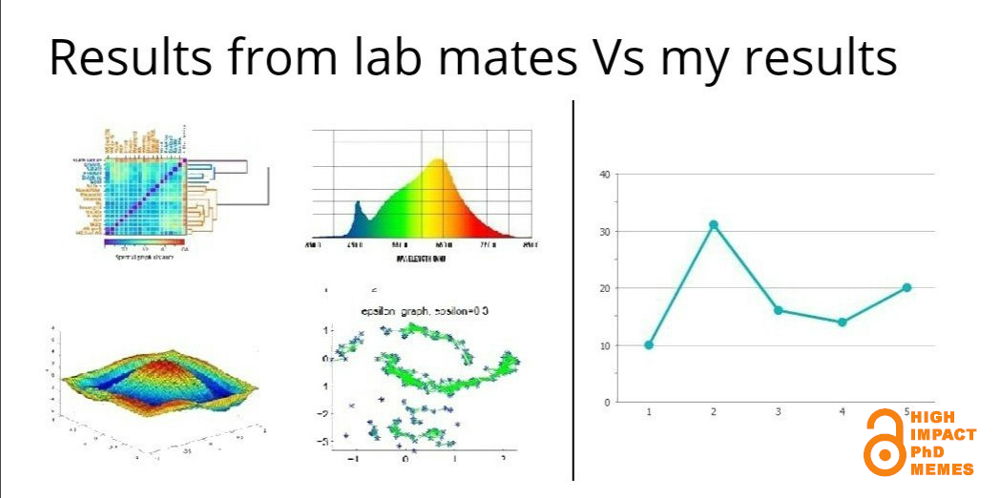

# Summarizing Data

## Are you ready?



### Wait... you guys are getting results???!


## Packages

- Here is a list of packages that we will use today:
  - ``modeest`` has the ``mfv()`` function for the mode.
  - ``moments`` has the ``skewness()`` and ``kurtosis()`` functions.
  - ``tidyverse`` contains the ``ggplot2`` package for data visualization.
  
- For those who hope to dive into the fancier data visualization tools, consider:
  - RShiny at https://shiny.posit.co/r/gallery/.
  - Extensions of the ``ggplot2`` package at https://exts.ggplot2.tidyverse.org/gallery/.

## Numerical methods

### Peabody data

- For the purpose of today's demonstration, we will use the following data from 40 children who completed the Peabody Developmental Motor Scales (PDMS).

- The PDMS is a popular standardized test used by physical and occupational therapists for children less than six.

- The variables include peabody scores, gender, and age (in months).

- The dataset is as follows:

```{r}
# Peabody data
peabody <- c(123,99,80,81,90,104,69,86,107,94,82,99,83,98,86,74,67,90,106,102,
             68,80,76,65,69,81,76,68,84,88,68,92,92,97,78,77,94,74,89,68)

gender <- c("M","F","F","F","F","M","F","F","F","F","M","M","M","M","M","M","M",
            "M","M","M","F","F","F","M","F","F","F","M","M","F","M","M","M","M",
            "M","M","M","M","M","M")

age <- c(35,45,38,40,38,42,36,45,34,36,36,51,34,35,37,37,36,36,37,32,22,28,18,20,
         25,18,14,26,14,24,14,26,11,12,26,17,16,23,12,13)
```

- These variables can be stored in a data frame with the following code:

```{r}
# Make a data frame
peabody_df <- data.frame(peabody = peabody, gender = gender, age = age)
```

### Central tendency

- Mean

```{r}
mean(peabody)
mean(peabody_df$peabody)
```

- Median

```{r}
median(peabody)
median(peabody_df$peabody)
```

- Mode

```{r}
library(modeest)
mfv(peabody)
```

### Variability

- Variance

```{r}
var(peabody)
```

- Standard deviation

```{r}
sd(peabody)
```

### Skewness

- There are multiple methods that can be used to calculate skewness in R:

- You could use the formula for skewness.
  
```{r}
# Define sample size
n <- length(peabody)

# Compute the skewness
(sum((peabody-mean(peabody))^3)/n)/(sum((peabody-mean(peabody))^2)/n)^(3/2)
```

- But the ``skewness()`` function in the ``moments`` package makes it even easier.
  
```{r}
library(moments)
skewness(peabody)
```

### Kurtosis

- There are multiple methods for calculating kurtosis in R.

- You can use the formula:

```{r}
n <- length(peabody)
(sum((peabody-mean(peabody))^4)/n)/(sum((peabody-mean(peabody))^2)/n)^2
```


- Or you can use the ``kurtosis()`` function in the ``moments`` package.

```{r}
kurtosis(peabody)
```

### Using the tidyverse package

- tidyverse allows us to use the ``summarise()`` function.
  - which allows us to get various descriptive statistics such as minimum, maximum, mean, median, variance, standard deviation, skewness, kurtosis, etc.

- As a small exercise, try to run the code below. What do you see?

```{r, eval=FALSE}
summarise(peabody_df,
          mean.peabody = mean(peabody),
          sd.peabody = sd(peabody),
          skew.peabody = moments::skewness(peabody),
          kurt.peabody = moments::kurtosis(peabody))
```
  
  
## Visual methods

- Be sure to refer to the cheatsheet I have attached on CatCourses!

- Every useful piece of information is there!

### Using the tidyverse package

- The ``ggplot2`` package is a core component of the tidyverse that allows us to build data visualizations.

- ChatGPT is so good at programming ``ggplot2`` code for you. But of course, sometimes it itself does produce wrong code, particularly when you want to do complicated visualizations.
  - It is suggested to know the fundamental grammar to be a smart user of the AI!

- The idea behind ``ggplot2`` is that every new concept we introduce will be layered on top of the information we've already learned.

- In this way, ``ggplot2`` uses layers of information added on top of each other to help build the graph.
  - This is most evidenced by how each line is separated by a plus sign (+). Each line of code is a different layer of the graph.
  
- You'll see what I mean as we go through several example graphs.

- Remember to work with a tibble instead of a data frame. Tibbles work much better in tidyverse.

```{r}
library(tidyverse)
peabody_tib <- as_tibble(peabody_df)
peabody_tib
```

- The type of plot you want to make is referred to as a ``geom``. There are dozens of ``geom`` options available in ``ggplot2``. For todays' lesson, we will focus on four specific ``geoms``:
  - ``geom_boxplot()``
  - ``geom_histogram()``
  - ``geom_bar()``
  - ``geom_point()``
  
- When using ``ggplot2``, plots will take the following general form:

```{r, eval=FALSE}
ggplot(data = DATASET, aes(VARIABLE(S))) +
  geom_PLOT_TYPE()
```

- First, you start with the ``ggplot()`` function, where you will specify the data.

- Second, you will include the ``aes`` argument, which is where you specify the variable(s) you want to plot.

- Third, you select the geom type (e.g., ``geom_boxplot()``) you are interested in plotting. This is also where you can begin to customize your plots.

### Boxplot

- Boxplots are a useful method for presenting the dispersion of the data, the symmetry of the distribution, and the potential outliers (or extreme scores).

- The following code provides a basic ``ggplot2`` setup for a boxplot of the peabody scorees:

```{r}
ggplot(data=peabody_tib, aes(peabody)) +
  geom_boxplot()
```

- By adding another layer, you can further customize your plot. In the code below, I illustrate how you can change the coloring of the boxplot and remove the tick marks on the x-axis.

```{r}
ggplot(data = peabody_tib, aes(y=peabody)) +
  geom_boxplot(fill = "purple", colour = "black") +
  scale_x_discrete( ) ## removes x-axis ticks
```

- You can also change the shape and color of the outlier.

- All you have to do is add another line of code that specifies the outlier color, shape, and size.

```{r}
ggplot(data = peabody_tib, aes(y=peabody)) +
  geom_boxplot(fill = "purple", color = "black",
               outlier.color = "red", outlier.shape = 18, outlier.size = 3) +
  scale_x_discrete( ) ## removes x-axis ticks
```

- There are several available shapes in ``ggplot2``. 
  - I provide some examples below, but you can see more here: https://ggplot2.tidyverse.org/articles/ggplot2-specs.html

```{r}
shapes <- data.frame(
  shape = c(0:19, 22, 21, 24, 23, 20),
  x = 0:24 %/% 5,
  y = -(0:24 %% 5)
)

ggplot(shapes, aes(x, y)) + 
  geom_point(aes(shape = shape), size = 5, fill = "red") +
  geom_text(aes(label = shape), hjust = 0, nudge_x = 0.15) +
  scale_shape_identity() +
  expand_limits(x = 4.1) +
  theme_void()
```

### Histograms

- Histograms are a useful method for presenting the dispersion of the data and the symmetry of the distribution.

- The following code provides the setup for a histogram of the peabody scores:

```{r}
ggplot(data = peabody_tib, aes(peabody)) +
  geom_histogram(color = "black", fill = "green")
```

- You can change the bindwidth of the histogram using the following code:

```{r}
ggplot(data = peabody_tib, aes(peabody)) +
  geom_histogram(color = "black", fill = "green",
               binwidth = 5)
```

- Alternatively, you could set the total number of bins with the ``bins`` argument.

- Sometimes you want to display plots for a subset of your data. This can be accomplished using the ``facet_wrap()`` function.

```{r}
ggplot(data = peabody_tib, aes(peabody)) +
  geom_histogram(color = "black", fill = "green", 
                 binwidth = 5) +
  facet_wrap(~gender, nrow = 1)
```

### Bar charts

- Bar charts are a useful method for displaying categorical data. They can show the number of cases in each of the categories.

```{r}
ggplot(data = peabody_tib, aes(gender)) +
  geom_bar(color = "black", fill = c("purple","green"))
```

- Perhaps you would like to change the ``F`` to Female and the ``M`` to Male. The x-axis ticks can be changed using the following trick:

```{r}
ggplot(data = peabody_tib, aes(gender)) +
  geom_bar(color = "black", fill = c("purple","green")) +
  scale_x_discrete(labels = c("Female", "Male")) ## Changes the labels on the x-axis ticks
```

- Sometimes it can be helpful to change the plot title, x-axis and y-axis.

```{r}
ggplot(data = peabody_tib, aes(gender)) + 
  geom_bar(color = "black", fill = c("purple","green")) +
  scale_x_discrete(labels = c("Female", "Male")) +
  labs(x='Gender',
       y='Count of Children',
       title='Gender Breakdown of Children') ## Allows you to change the title and axis labels
```

### Scatterplots

- Scatterplots are a useful method for visualizing the relationship between two numerical variables. We will not discuss how to interpret the scatterplot today, but I thought it might be helpful for you to see how the ``geom_point()`` function works.

```{r}
ggplot(data = peabody_tib, aes(peabody,age)) +
  geom_point(shape = 19, size = 2.5, color = "cyan3")
```

### Important points about data visualization

- At its core, the term 'data visualization' refers to any visual display of data that helps us understand the underlying data better.

- Generally, there are a few charactersitics of all godo plots [Note: This is not an exhaustive list].

  - Clearly-labeled axes.
  - Text that are large enough to see.
  - Axes that are not misleading.
  - Data that are displayed appropriately considering the type of data you have.

## Final exercise

- Using the age variable, find the following summary statistics:

  - mean
  - median
  - standard deviation
  - skewness
  - kurtosis

- Using the age variable, create a histogram with the following features:

  - colored bars.
  - 10 bins [Hint: use ``bins`` argument].
  - a title of "Age of Children (in months)" [Hint: use ``labs()`` function].


